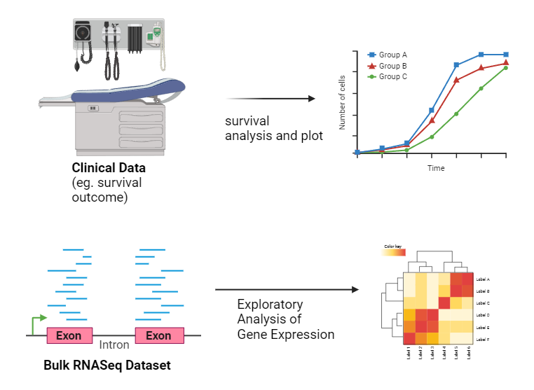

<!-- README.md is generated from README.Rmd. Please edit that file -->

# ClinicalTranscriptLink

<!-- badges: start -->
<!-- badges: end -->

## Description

`ClinicalTranscriptLink` is a package that aims to identify correlations
between clinical expression of cancers and the transcriptional
expression of genes using bulk RNA sequencing data. Packages currently
available only study one of these and do not provide much correlation
between the clinical expression of diseases and the corresponding gene
expression. As such, this package aims to create that link to help us
better understand the relation. Specifically, the package aims to
study: - 1) the type of cancer and its relation to gene expression - 2)
the survival analysis of different types of cancer

This package contains functions to perform analysis as well as
visualisation of the above two goals. The `ClinicalTranscriptLink`
package was developed using `R version 4.3.1 (2023-06-16)`,
`Platform: x86_64-w64-mingw32/x64 (64-bit)` and
`Running under: Windows 11 x64 (build 22631)`.

## Installation

You can install the development version of ClinicalTranscriptLink from
[GitHub](https://github.com/) with:

``` r
# install.packages("devtools")
devtools::install_github("michellemlin/ClinicalTranscriptLink", build_vignettes = TRUE)
library(ClinicalTranscriptLink)
```

To run the Shiny app: under construction

## Overview

For an example of use of ClinicalTranscriptLink:

``` r
ls("package:ClinicalTranscriptLink")
data(package = "ClinicalTranscriptLink") 
browseVignettes("ClinicalTranscriptLink")
```

`ClinicalTranscriptLink` provides the following functions at the moment:

- `metadataExtract` : a function that allows users to extract metadata
  from from clinical data

- `SurvivalMapVis` : a function that allows users to conduct survival
  analysis using package `survival`

- `survivalExplore` : a function that allows users to explore metadata
  through visualisations



## Contributions

This package was created by `Michelle Lin` and contains functions found
in packages `survival`, `survminer`, `dplyr` for survival analysis and
`DESeq2` that will be used for differential expression analysis.

## References

- H. Wickham. ggplot2: Elegant Graphics for Data Analysis.
  Springer-Verlag New York, 2016.

- Kosinski M (2023). *RTCGA.clinical: Clinical datasets from The Cancer
  Genome Atlas Project*. <doi:10.18129/B9.bioc.RTCGA.clinical>
  <https://doi.org/10.18129/B9.bioc.RTCGA.clinical>, R package version
  20151101.30.0, <https://bioconductor.org/packages/RTCGA.clinical>.

- Kosinski M (2023). *RTCGA.rnaseq: Rna-seq datasets from The Cancer
  Genome Atlas Project*. <doi:10.18129/B9.bioc.RTCGA.rnaseq>
  <https://doi.org/10.18129/B9.bioc.RTCGA.rnaseq>, R package version
  20151101.30.0, <https://bioconductor.org/packages/RTCGA.rnaseq>.

- Love, M.I., Huber, W., Anders, S. Moderated estimation of fold change
  and dispersion for RNA-seq data with DESeq2 Genome Biology 15(12):550
  (2014)

- R Core Team (2023). *R: A Language and Environment for Statistical
  Computing*. R Foundation for Statistical Computing, Vienna, Austria.
  <https://www.R-project.org/>

- Therneau T (2023). *A Package for Survival Analysis in R*. R package
  version 3.5-5, <https://CRAN.R-project.org/package=survival>.

- Kassambara A, Kosinski M, Biecek P (2021). *survminer: Drawing
  Survival Curves using ‘ggplot2’*. R package version 0.4.9,
  <https://CRAN.R-project.org/package=survminer>.

- Wickham H, Francois R, Henry L, Muller K, Vaughan D (2023). *dplyr: A
  Grammar of Data Manipulation*. R package version 1.1.3,
  <https://CRAN.R-project.org/package=dplyr>.

## Acknowledgements

This package was developed as part of an assessment for Fall 2023
BCB410H1: Applied Bioinformatics course at the University of Toronto,
Toronto, CANADA. ClinicalTranscriptLink welcomes issues, enhancement
requests, and other contributions. To submit an issue, use the GitHub
issues.
